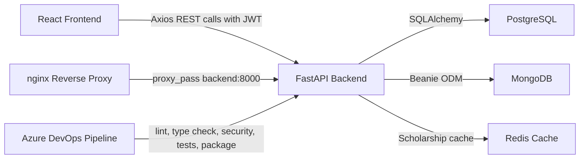
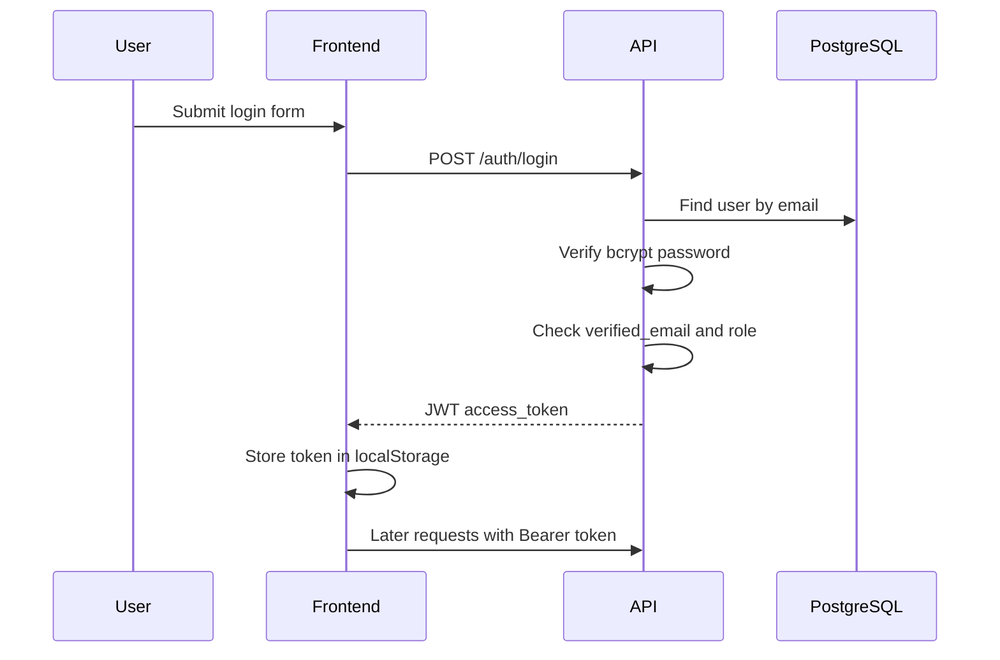
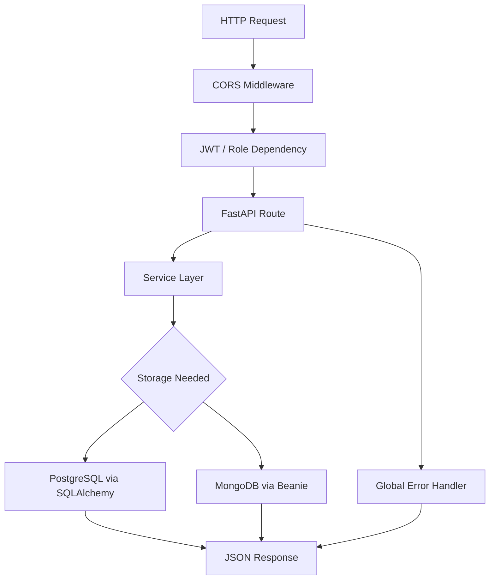
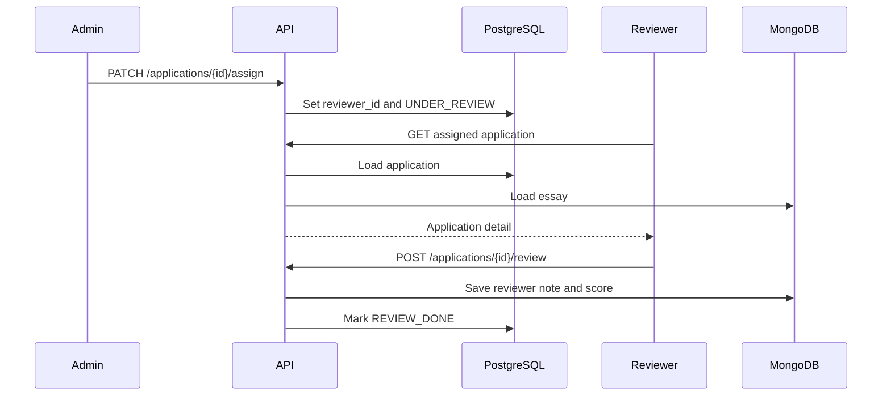
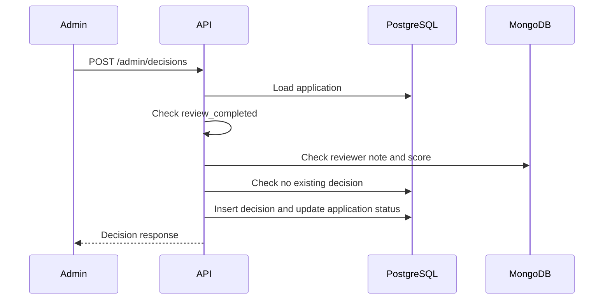
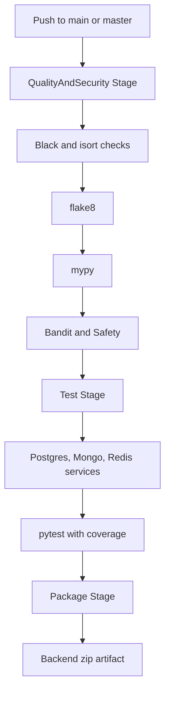
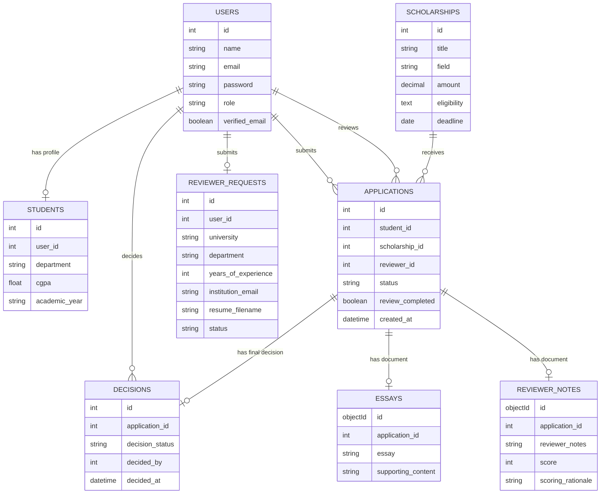
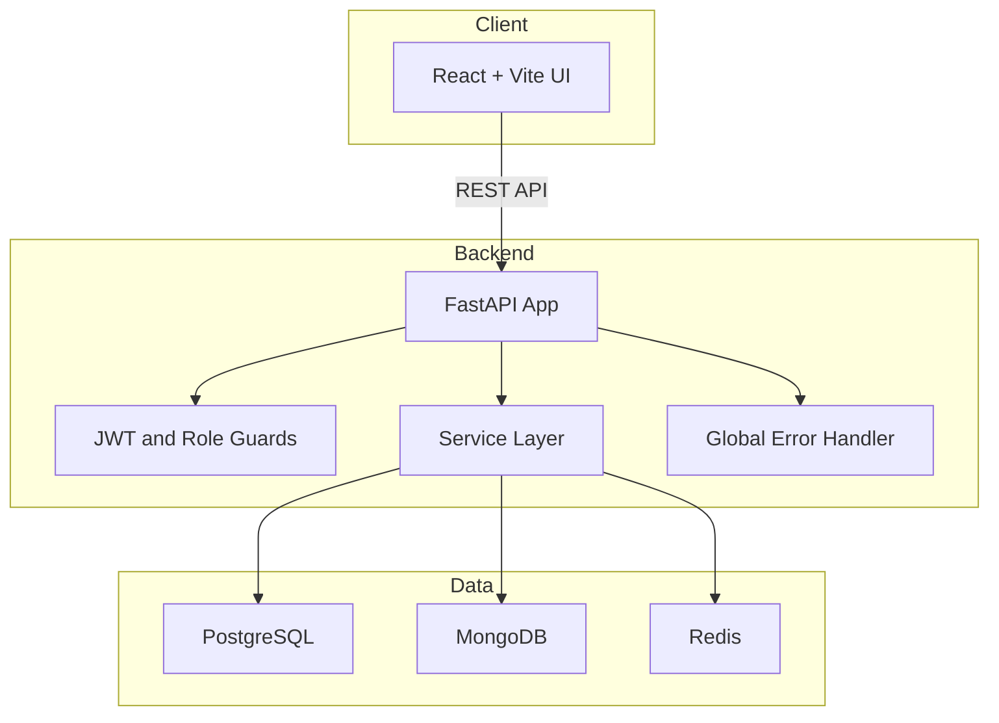
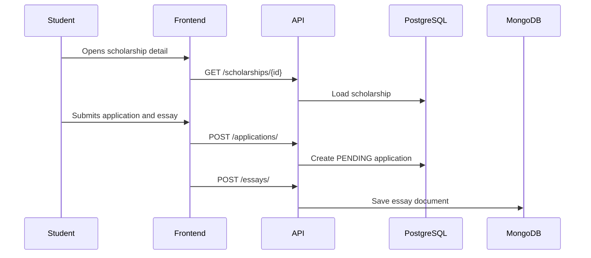

# ScholarTrack Architecture

## System Overview

ScholarTrack is split into:

- React frontend served by Vite during development.
- FastAPI backend exposing REST endpoints.
- PostgreSQL for relational business records.
- MongoDB for essay and reviewer note documents.
- Redis for optional scholarship list caching.
- nginx reverse proxy configuration for backend forwarding.
- Azure DevOps pipeline for quality, security, tests, and packaging.

## Component Diagram

## Data Flow

1. The frontend stores JWT in `localStorage`.
2. Axios interceptor adds `Authorization: Bearer <token>`.
3. FastAPI decodes JWT and applies role guards.
4. SQLAlchemy reads and writes relational data in PostgreSQL.
5. Beanie reads and writes essays and reviewer notes in MongoDB.
6. Responses are returned as JSON.
7. Global error handlers format errors as `{ success: false, error: ... }`.

## Frontend Architecture

Frontend files live in `frontend/src`.

Key folders:
- `pages`: route-level screens.
- `components`: shared layout, navbar, sidebar, loader, error message.
- `services`: Axios API wrappers.
- `context`: auth token context.

Routing is defined in `frontend/src/App.jsx`.

API integration is centralized in `frontend/src/services/api.js`, which sets `baseURL` from `VITE_API_BASE_URL` and attaches the JWT token from `localStorage`.

## Backend Architecture

Backend files live in `backend/app`.

Key folders:
- `config`: environment settings, database setup, MongoDB setup, Redis, logging, rate limiter, security.
- `models`: SQLAlchemy models and MongoDB Beanie documents.
- `schemas`: Pydantic request and response models.
- `routes`: API routers.
- `services`: business logic.
- `repositories`: user and student data access helpers.
- `middleware`: auth, role checks, CORS, global errors.
- `utils`: enums, sanitization, constants, helpers.

`backend/app/main.py` creates the FastAPI app, configures logging, initializes startup, registers middleware, and includes all routers.

## PostgreSQL Architecture

PostgreSQL stores the main relational workflow.

Entities:
- `users`
- `students`
- `scholarships`
- `applications`
- `decisions`
- `reviewer_requests`

Relationships:
- `students.user_id` references `users.id`
- `applications.student_id` references `users.id`
- `applications.scholarship_id` references `scholarships.id`
- `applications.reviewer_id` references `users.id`
- `decisions.application_id` references `applications.id`
- `decisions.decided_by` references `users.id`
- `reviewer_requests.user_id` references `users.id`

The application has a unique rule preventing the same student from applying to the same scholarship twice.

## MongoDB Architecture

MongoDB stores document-like application content:

- `essays`
- `reviewer_notes`

Both documents connect to the relational application using `application_id`.

## Authentication Flow

## Application Lifecycle

FastAPI startup runs through `lifespan` in `backend/app/main.py`:

1. Ensure PostgreSQL database exists.
2. Create missing SQLAlchemy tables with `Base.metadata.create_all(bind=engine)`.
3. Initialize MongoDB Beanie documents.
4. Serve requests.
5. Log shutdown.

## Request Flow

## Review Workflow

## Decision Workflow

## CI/CD Workflow

## Database Relationship Diagram

## High Level Architecture

## Application Submission Flow

